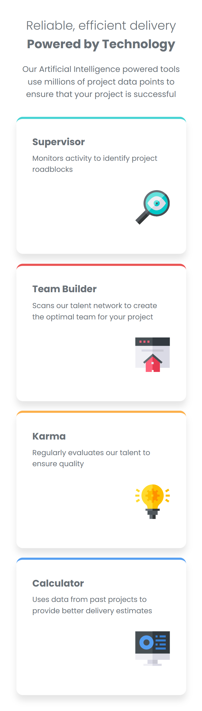
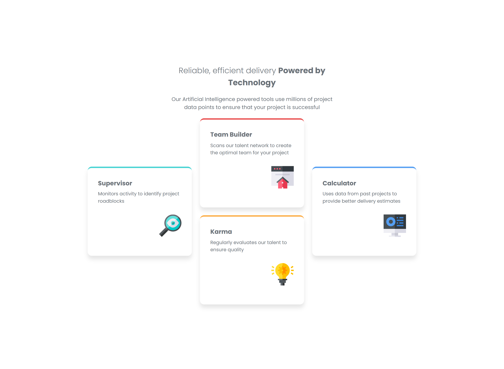

# Frontend Mentor - Four card feature section solution

This is a solution to the [Four card feature section challenge on Frontend Mentor](https://www.frontendmentor.io/challenges/four-card-feature-section-weK1eFYK). Frontend Mentor challenges help you improve your coding skills by building realistic projects.

## Table of contents

- [Overview](#overview)
  - [The challenge](#the-challenge)
  - [Screenshot](#screenshot)
  - [Links](#links)
  - [Built with](#built-with)
- [Author](#author)

**Note: Delete this note and update the table of contents based on what sections you keep.**

## Overview

### The challenge

Users should be able to:

- See hover and focus states for all interactive elements on the page

### Screenshot

### Links

- Link To Repo: [My repo url](https://github.com/RogueMutant/practice/tree/main/css/four-card)
- Live Site URL: [solution URL](https://roguemutant.github.io/practice/)

### Built with

- Semantic HTML5 markup
- Flexbox
- Grid
- Media queries
- Mobile-first workflow

## Author

- Frontend Mentor - [@RogueMutant](https://www.frontendmentor.io/profile/@RogueMutant)
- Twitter - [@Rogue_Mutant](https://www.twitter.com/@Rouge_Mutant)
