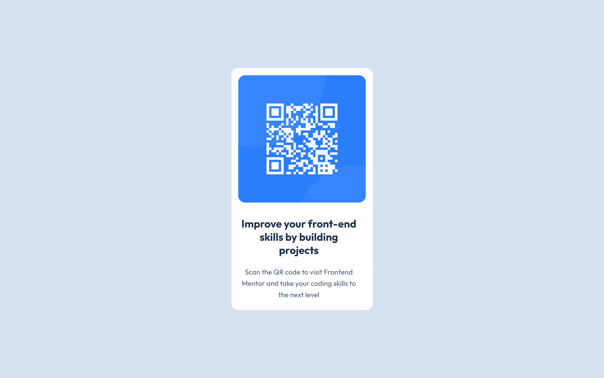

# Frontend Mentor - QR code component solution

This is a solution to the [QR code component challenge on Frontend Mentor](https://www.frontendmentor.io/challenges/qr-code-component-iux_sIO_H). Frontend Mentor challenges help you improve your coding skills by building realistic projects.

## Overview

### Screenshot
<<<<<<< HEAD

### Links

- Link To Repo: https://github.com/RogueMutant/practice/tree/main/css/qr
- Live Site URL: [Add live site URL here](https://your-live-site-url.com)
=======

### Links

- Link Ro Repo: https://github.com/RogueMutant/practice/tree/main/css/qr
>>>>>>> 5ff52ec2f081700f409963db4482326c316426cc

### Built with

- Semantic HTML5 markup
- Sass
- Flexbox
- Mobile-first workflow
